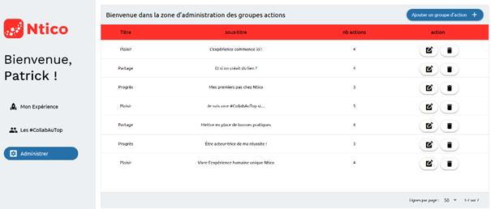
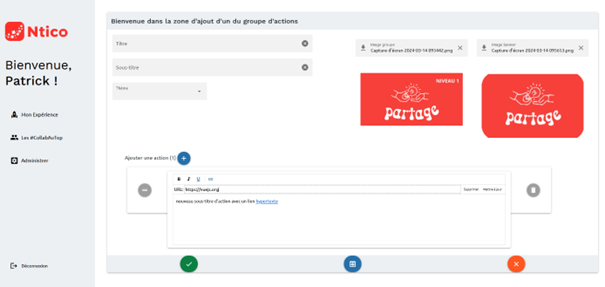

# Rapport de stage 2024 entreprise Ntico  : application web Client VueJS, Serveur Java Spring Boot

Rapport de stage de fin de formation RNCP Concepteur Développeur d'applications à l'ESN [Ntico ](https://www.ntico.com/)de Montpellier

Ma période de stage en entreprise a débuté par une immersion au sein du
département Opérations, où j'ai acquis une compréhension de l'application de
planification OpCon de SMA, entreprise avec laquelle Ntico est devenu leur
partenaire exclusif pour la zone Europe francophone en avril dernier. Dans le
cadre de ce service, j'ai contribué au projet Fluence, visant à identifier les
différents cas d'utilisation de cette future application destinée aux clients
de l'ordonnanceur OpCon.

Après trois semaines, j'ai rejoint l'équipe Ntico Service pour travailler
sur l'administration de leur application Web XPérince en cours de
développement, conçue pour gérer le parcours des collaborateurs. Cette
application, via des groupes d'action, facilite l'adoption de bonnes pratiques,
que ce soit pour la tenue de réunions, la nomination des variables en Java, ou
encore le processus d'intégration des nouveaux employés.

Dans le cadre du projet XPérienCe, mes responsabilités incluaient

- L’analyse du besoin, suivant l’expression de la demande par le chef de projet,
- La conception de la maquette, avec l’application web de maquettage Figma,
- Le développement côté client et le coté serveur de l'application web, avec :
  - Côté client une application à page unique en VueJS 3 avec le framework Quasar 2, consommant une API RESTful (interface de programmation, API ou PAI web, qui respecte les contraintes du style d’architecture REST, Representational State Transfert, d’OpenAPI[[1]](#_ftn1))
  - Côté back, un serveur développé en Java avec le SDK 17 et le framework Spring Boot 3, assurant la logique métier et le requêtage vers la base de données PostgreSQL.

Dans un premier temps, mon travail comprenait l'analyse des exigences,
traduites ensuite en scénarios d'utilisation sous forme de cas d’utilisation. Par
la suite, j'ai acquis les compétences nécessaires sur les différentes
technologies utilisées dans le projet, suivi de la familiarisation avec les
composants déjà développés, tant côté client que serveur, ainsi que la structure
de base de données.

Dans un deuxième temps, j'ai axé mes efforts sur la définition des patterns
DTO[[2]](#_ftn2) et des URI[[3]](#_ftn3) pour établir le contrat entre le client et le serveur pour la partie administration.
Avec le développement du côté client qui a suivi les meilleures pratiques de l'entreprise et a été aligné autant que possible sur la méthodologie déjà en place. Pour ce front-end, l'utilisation du framework Quasar a permis une découpe modulaire de l'application, où j'ai combiné des composants existants avec mes propres développements.

Dans un troisième temps, j'ai mis en œuvre la partie serveur en utilisant des méthodes déjà présentes, en les adaptant si nécessaire pour intégrer les règles métiers. Le développement avec Spring Boot a impliqué une abstraction de haut niveau. L'utilisation de la librairie MapStruct, a facilité la transformation des objets de DTO à Entité et vice versa. Mon développement
devait respecter les tests unitaires existants.

Mon travail était régulièrement suivi lors de réunions quotidiennes avec l'équipe de développement, ainsi qu'au cours des réunions hebdomadaires de projet. Le suivi des tâches était effectué via un tableau Kanban sous Trello, permettant au responsable de projet de suivre mes avancées.

Après des sessions de revue de code avec les chefs de service et les développeurs, j'ai soumis mes pull requests via l'IDE IntelliJ pour le back et VSCode pour le front, vers le référentiel GitHub du projet, en prenant en compte les commentaires des Lead Dev en vue des merges vers la branche finale.

---

[**[1]**](#_ftnref1) https://swagger.io/specification/

[**[2]**](#_ftnref2) Concept utilisé pour transférer des données entre différentes parties d’une application logicielle

[**[3]**](#_ftnref3) Uniform Resource Identifier (URI), est une courte chaîne de caractères qui permet d’identifier une ressource sur un réseau
